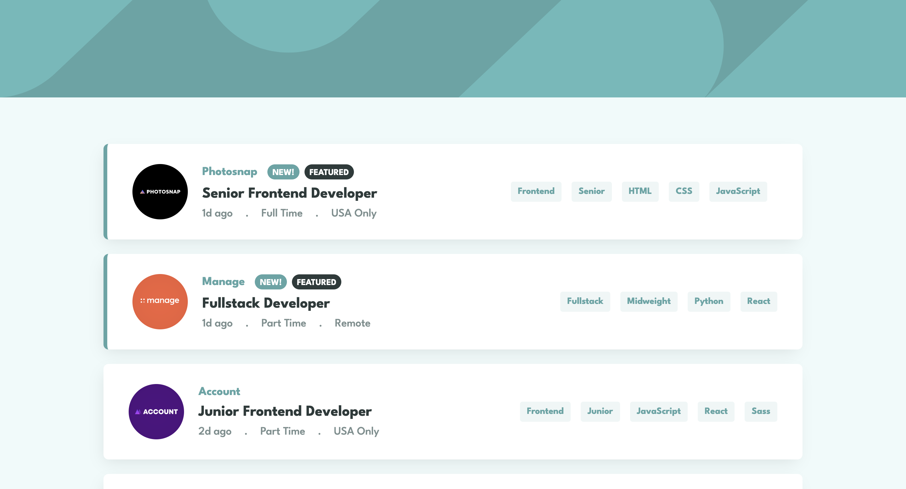
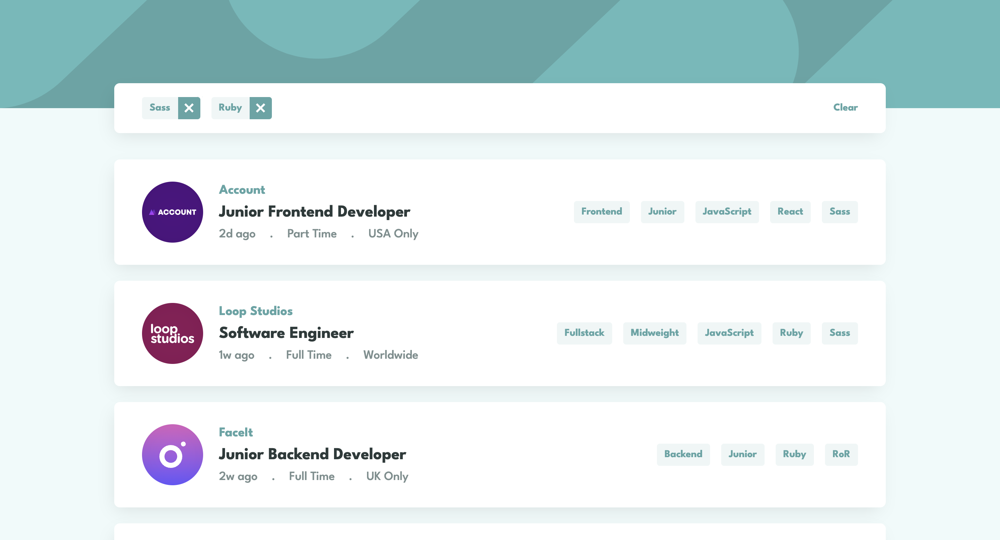

# JobSorter

## Table of contents

- [Overview](#overview)
  - [The challenge](#the-challenge)
  - [Screenshot](#screenshot)
  - [Links](#links)
- [My process](#my-process)
  - [Built with](#built-with)
  - [What I learned](#what-i-learned)
  - [Challenges faced](#challenges-faced)
  - [Continued development](#continued-development)
  - [Useful resources](#useful-resources)
- [Author](#author)

## Overview

### The challenge

Users should be able to:

- View the optimal layout for the site depending on their device's screen size
- See hover states for all interactive elements on the page
- Filter job listings based on the categories

### Screenshot

Insert a screenshot of your solution here. Replace the path and alt text accordingly.

### Links

- [GitHub repo](https://github.com/Aymmaann/JobSorter/tree/main)
- [Live Site](https://jobsorter.netlify.app/)

## My process

### Built with

- HTML5
- CSS3 (custom properties, Flexbox, Grid)
- JavaScript (ES6+)

### What I learned

During this project, I consolidated my understanding of creating dynamic user interfaces with JavaScript and applying responsive design techniques. Here are some key takeaways:

- **DOM Manipulation:** Learned advanced techniques for manipulating the Document Object Model (DOM) to dynamically update content based on user interactions.
  
- **Event Handling:** Improved skills in handling user events such as clicks and hover effects, enhancing the interactivity of the application.
  
- **Responsive Design:** Practiced implementing responsive layouts using CSS Flexbox and Grid, ensuring the application is accessible across different devices and screen sizes.

- **Optimized HTML Structure:** By leveraging JavaScript to dynamically create HTML elements based on JSON data, I significantly reduced redundancy in my code. This approach not only simplified the HTML file but also improved maintainability and scalability.

- **Dynamic Content Generation:** Utilizing the Fetch API, I retrieved JSON data asynchronously and parsed it to dynamically generate job listing cards on the webpage. This method allowed for real-time updates and seamless integration of new job listings without modifying the HTML structure manually.

### Challenges faced

Implementing dynamic filtering functionality posed a significant challenge. Ensuring seamless interaction for users to filter job listings based on role, level, languages, and tools required precise DOM manipulation and event handling in JavaScript.

Another hurdle was refining the filter tab's user interface. I aimed for smooth tag selection and removal, ensuring job listings updated instantly without lag. This required meticulous design and responsive implementation to maintain a seamless user experience across devices.

Integrating the filtering logic with existing job cards while maintaining intuitive user interactions also proved challenging. Balancing UI design and functionality enhancements was crucial to deliver a polished and effective filtering system.

These challenges strengthened my problem-solving skills and deepened my understanding of interactive web application development.

### Continued development

In future projects, I aim to refine my skills in handling complex data interactions more efficiently. I also plan to explore advanced CSS techniques to further enhance the visual appeal and responsiveness of web applications. Additionally, I intend to deepen my understanding of accessibility standards to ensure inclusivity in all my projects.

### Useful resources

- [MDN Web Docs](https://developer.mozilla.org/) - Comprehensive web development documentation
- [Frontend Mentor](https://www.frontendmentor.io/challenges) - Platform for practicing frontend coding challenges
- [CSS Tricks](https://css-tricks.com/) - Helpful tips and tricks for CSS styling and layout

## Author

- Website - [My portfolio](https://ayman03-portfolio.netlify.app/)
- Frontend Mentor - [@Aymmaann](https://www.frontendmentor.io/profile/Aymmaann)
